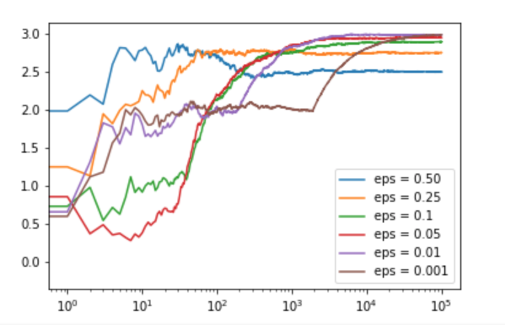

# Inroduction: Multi-Armed Bandit Problem

<h5 style="{font-family:"Garamond"}> The multi-armed bandit problem is a fundamental problem in reinforcement learning. The basic problem involves three (this could be generalized to N arms) different distributions (bandits) with static means and variances. The goal to this problem is finding an agent (algorythm) that can estimate the means and variances of the bandits with some degree of certainty in the most most optimal amount of time for any given bandits (distributions).
</>
#### *Why "Bandits"?*

##### Back in the good ole days of gambling, people would flock to the casinos to get a chance to wage their hard earned money on the deceptive slot machines by pulling a long arm. Now we use more high-tech touch screens to mimic these simulations of gambling. Of course, no casino would be profitable if there underlying distributions to each machine wasn't atleast slightly in the faover of the casino's. Thus, the name multi-armed "bandit".

## The Problem

##### The problem I am exploring is with three different bandits initialized with normal distributions. Later I will explore a more complicated version of the problem which uses other distributions (e.g. Exponential, Poisson etc.). Below is the order in which I will Explore this problem.

- [x] Introduction
- [ ] Explore large and small values of Epsilon
- [ ] Explore normal distributions with closer means
- [ ] Explore variance
- [ ] Generalize agent based on exploration
- [ ] Use non-parametized tests to estimated means of bandits
- [ ] Conclusion of my findings


### Explore Epsilon Values
- [x] Explore large and small values of Epsilon

```python
c_25 = run_experiment(1.0,2.0,3.0, 0.5, 100000)
c_25 = run_experiment(1.0,2.0,3.0, 0.25, 100000)
c_1 = run_experiment(1.0,2.0,3.0, 0.1, 100000)
c_05 = run_experiment(1.0,2.0,3.0, 0.05, 100000)
c_01 = run_experiment(1.0,2.0,3.0, 0.01, 100000)
c_001 = run_experiment(1.0,2.0,3.0, 0.001, 100000)

```
<p align="center">
  <h2>Compare Epsilon and Convergance </>
  

| Epsilon       | Long Term Payout   | Rate of Convergance  |
| ------------- |:------------------:| --------------------:|
| 0.001         |   2.98424162       |                      |
| 0.01          |   2.98545949       |   $12                |
| 0.05          |   2.94623982       |    $1                |
| 0.1           |   2.89199996       |                      |
| 0.25          |   2.74934096       |   $12                |
| 0.50          |   2.49796348       |    $1                |
